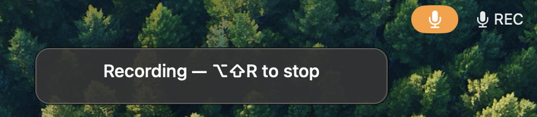

# Dictation basics

Dictation is Scribe's core feature: press a shortcut, speak, press it again, and
your words appear as text. This page covers the recording flow and the two ways
your transcript can reach you.

## The hotkey flow

Every recording mode has its own global shortcut. Press it once to start
recording, press it again to stop. The shortcuts work from any app — Scribe does
not need to be in front.

For the default Dictation mode:

1. Click into the text field where you want the text.
2. Press **Option + Shift + R** to start recording.
3. Speak.
4. Press **Option + Shift + R** again to stop.

The transcript is saved to your recordings folder, and (with auto-paste on) it
is pasted at your cursor. The transcript is also saved as a Markdown file next
to the audio recording.

## The recording indicator

While a recording is running, a floating indicator shows the shortcut that stops
it, so you always know Scribe is listening and how to stop.

## Live typing versus auto-paste

Scribe can deliver a transcript to your cursor in two ways. Each recording mode
sets which one it uses.

- **Auto-paste** waits until you stop recording, then pastes the finished
  transcript at your cursor in one go. Your clipboard is restored afterward.
  This is on by default in Dictation mode.
- **Live typing** types each completed phrase as you speak, so text appears
  while the recording is still running, in addition to the final saved file.
  This is off by default.

Both options are set per mode in Preferences. You can turn on live typing, keep
auto-paste, or use save-only (neither), depending on the mode. See
[Recording modes](recording-modes.md) for how to change them, and
[Preferences reference](preferences.md) for where the controls live.

> **Note:** Auto-paste and live typing both need the Accessibility permission,
> because typing at your cursor counts as controlling another app. Without it,
> Scribe still saves the transcript and copies it to the clipboard so you can
> paste it yourself with Cmd + V. See
> [Getting started](getting-started.md#accessibility-for-auto-paste).

## Finding recent transcripts

Recent transcripts are one click away: the menu bar icon, the Dock menu, and the
File menu all list them under **Recent Transcripts**. You choose how many appear
in Preferences (see [Preferences reference](preferences.md#recent-transcripts)).
