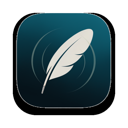
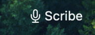
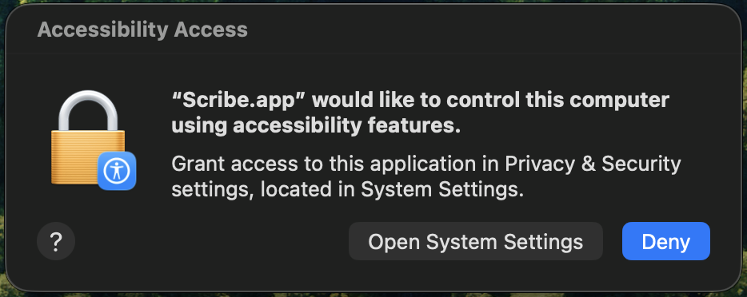
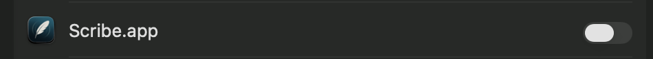
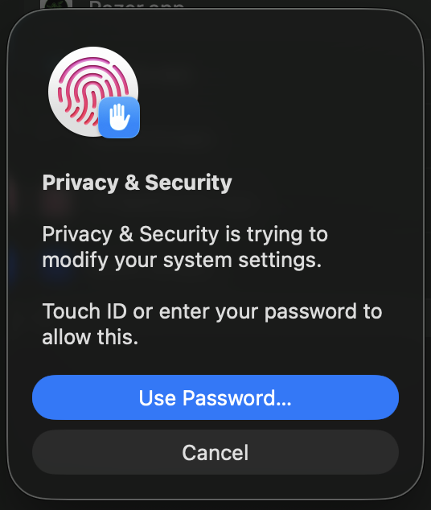
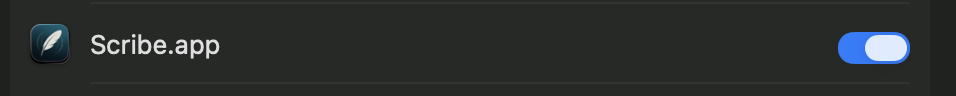
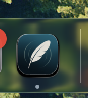

# Getting started

Scribe is a free dictation app for macOS. It lives in your menu bar, listens
when you press a keyboard shortcut, and transcribes your speech entirely on your
Mac. This page gets you from download to your first transcript.

## Requirements

- An Apple Silicon Mac (arm64).
- macOS 13 or later.

## Install

1. Download `Scribe-Installer.dmg` from the
   [latest release](https://github.com/AgentC-Consulting/scribe-app/releases/latest).
2. Open the DMG and drag **Scribe** into **Applications**.
3. Launch Scribe from Applications. The app is code-signed and notarized, so no
   security warnings are expected.

After it launches, Scribe appears as a microphone icon in the menu bar. It has
no Dock icon by default.

Click the microphone icon at any time to open Scribe's menu.

## First-run setup wizard

The first time you launch Scribe, a setup wizard walks you through the
permissions Scribe needs. You can also reopen the wizard later from Scribe's
menu.

macOS requires your explicit approval before any app can use the microphone,
control other apps, or capture system audio. Scribe asks for exactly the
permissions its features use, and nothing more.

### Microphone (required)

Scribe needs the microphone to record your voice. macOS shows this prompt the
first time you start a recording. Grant it, and you are ready to dictate.

If you declined it earlier, turn it back on under **System Settings > Privacy &
Security > Microphone**.

### Accessibility (for auto-paste)

Auto-paste types the finished transcript at your cursor, which macOS treats as
controlling another app. Scribe needs the Accessibility permission to do this.

The wizard guides you through the grant in four steps:

**1. Start the grant.** The wizard opens the Accessibility settings and shows a
prompt to grant access.

**2. Find Scribe in the list.** In **System Settings > Privacy & Security >
Accessibility**, locate the Scribe row. Its switch starts in the off position.

**3. Confirm with Touch ID or your password.** When you flip the switch on,
macOS asks you to confirm.

**4. Confirm the switch is on.** The Scribe row now shows the switch in the on
position.

**Then restart Scribe.** macOS only applies this permission when the app
launches, so the grant does not take effect until you quit and reopen Scribe.
The wizard includes a **Restart Scribe** button for exactly this reason.

> **Note:** Without Accessibility, Scribe still works. Transcripts are saved and
> copied to the clipboard, and you paste them yourself with Cmd + V. Auto-paste
> and live typing are the features that need this permission.

### Screen Recording (for Meeting mode only)

Meeting mode captures system audio — the other side of a call — and macOS
bundles system-audio capture under Screen Recording. Grant it under **System
Settings > Privacy & Security > Screen Recording**, then restart Scribe.

Dictation mode never needs Screen Recording. You only have to grant it if you
plan to use Meeting mode. See [Meeting transcription](meeting-transcription.md).

### Notifications (optional)

Scribe uses notifications to tell you when a transcription finishes or when
something needs your attention. Manage them under **System Settings >
Notifications**.

## Your first dictation

1. Click into any text field — a note, an email, a chat box.
2. Press **Option + Shift + R** to start recording, and speak.
3. Press **Option + Shift + R** again to stop.

The transcript is saved to your recordings folder and pasted at your cursor
(when auto-paste is enabled). For the full flow, see
[Dictation basics](dictation-basics.md).

Scribe auto-detects your language — it transcribes 25 European
languages, with nothing to select first. See [Supported languages](languages.md)
for the full list.

> **Note:** Everything runs locally. Audio never leaves your Mac, and no network
> connection is needed for transcription.

## Prefer the Dock?

Turn on **Show in Dock** in Preferences, and the same menu — recent transcripts
included — becomes available from Scribe's Dock icon.

